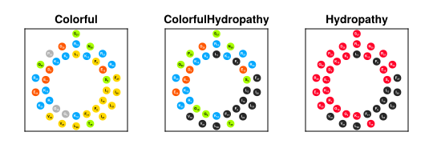

# PeptideProjections

PeptideProjections is a Julia package for visualizing peptide sequences using different projection methods and color themes. It provides an intuitive way to analyze and present protein sequences with various visualization styles.

## Installation
This package is not registered in the Julia general registry at the moment. You can install it using the following command:

```julia-repl
] add https://github.com/jowch/PeptideProjections.jl
```

## Quick Start

```julia
using PeptideProjections
using CairoMakie  # For plotting

# Create a wheel plot with default theme
plotwheel("LLGDFFRKSKEKIGKEFKRIVQRIKDFLRNLVPRTES")

# Create a net plot with a specific theme
plotnet("LLGDFFRKSKEKIGKEFKRIVQRIKDFLRNLVPRTES", theme=ColorfulHydropathy)
```

Regenerate the example figures (PNG and SVG) from the package root:

```julia
julia --project examples/example.jl
```

## Available Themes

1. Colorful - Highlights different amino acid properties with distinct colors
2. ColorfulHydropathy - Emphasizes hydropathy while maintaining charge information
3. Hydropathy - Emphasizes hydropathy with hydrophobic residues in black and polar residues in red




## API Reference

### Main Functions

- `plotwheel(sequence, rot=0; theme=Colorful, scale=150, markersize=nothing, coords=wheelcoords(sequence, rot))` — create a wheel projection in a new figure. `scale` sets export pixel size only (`scale .* (15, 4)`).
- `plotwheel!(ax, sequence, rot=0; theme=Colorful, markersize=nothing, coords=wheelcoords(sequence, rot))` — draw a wheel on an existing axis. Sets `DataAspect` and axis limits from disk extent.
- `plotnet(sequence, rot=0; theme=Colorful, scale=150, markersize=nothing, coords=netcoords(sequence, rot))` — create a net projection in a new figure. `scale` sets export pixel size only (`scale .* (4, 1.2)`).
- `plotnet!(ax, sequence, rot=0; theme=Colorful, markersize=nothing, coords=netcoords(sequence, rot))` — draw a net on an existing axis. Applies display compression on the index/angular axes, sets `DataAspect`, and sets limits from disk extent.

`markersize` is the residue disk **diameter in data units**; when omitted, `default_markersize` sizes disks from placement geometry so they do not overlap.

Pass `coords` (a `Vector{Point2f}`, one point per residue) to plot measured positions instead of the idealized helical placement.

### Placement

- `netcoords(sequence, rot=0) -> Vector{Point2f}` — idealized net placement; the angular coordinate is in radians with period `2π`
- `wheelcoords(sequence, rot=0) -> Vector{Point2f}` — idealized helical-wheel placement
- `default_markersize(coords, Wheel)` / `default_markersize(coords, Net)` — default disk diameter from pairwise spacing (`Net` applies the same display compression as `plotnet!`)

### Theme Colors

- `themecolor(theme, aa)` — marker color for an amino acid under a theme
- `themetextcolor(theme, aa)` — label text color chosen for contrast on the marker fill

## Contributing

Contributions are welcome! Please feel free to submit a pull request or open an issue.

## License

This project is licensed under the MIT License - see the LICENSE file for details.
