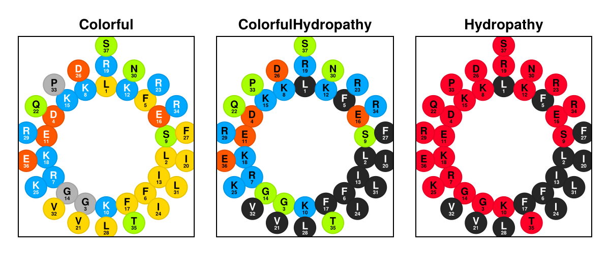
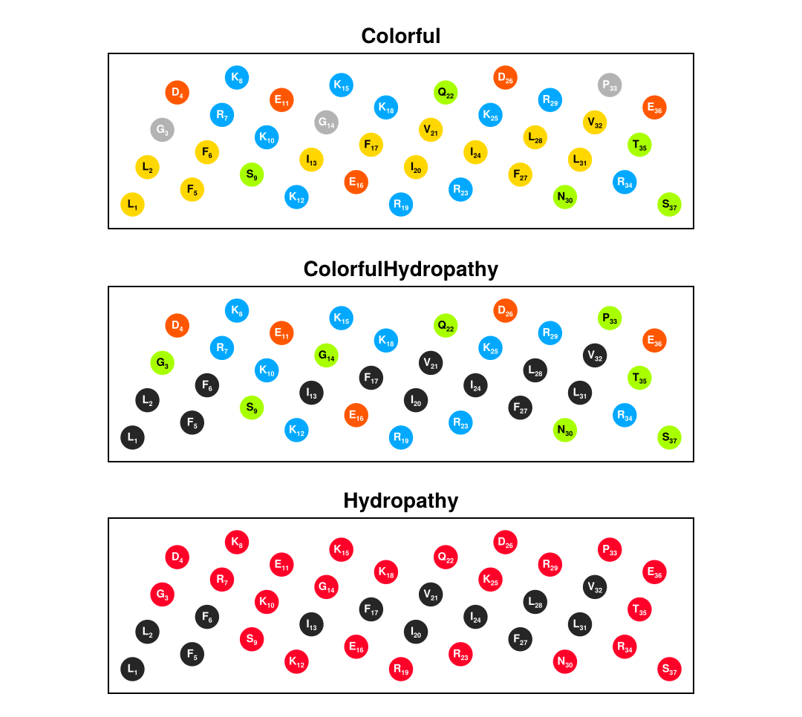

# PeptideProjections

PeptideProjections is a Julia package for visualizing peptide sequences using different projection methods and color themes. It provides an intuitive way to analyze and present protein sequences with various visualization styles.

## Installation
This package is not registered in the Julia general registry at the moment. You can install it using the following command:

```julia-repl
] add https://github.com/jowch/PeptideProjections.jl
```

## Quick Start

```julia
using PeptideProjections
using CairoMakie  # For plotting

# Create a wheel plot with default theme
plotwheel("LLGDFFRKSKEKIGKEFKRIVQRIKDFLRNLVPRTES")

# Create a net plot with a specific theme
plotnet("LLGDFFRKSKEKIGKEFKRIVQRIKDFLRNLVPRTES", theme=ColorfulHydropathy)
```

## Available Themes

1. Colorful - Highlights different amino acid properties with distinct colors
2. ColorfulHydropathy - Emphasizes hydropathy while maintaining charge information
3. Hydropathy - Emphasizes hydropathy with hydrophobic residues in black and polar residues in red




## API Reference

### Main Functions

- `plotwheel(sequence, rot=0; theme=Colorful, scale=150, coords=wheelcoords(sequence, rot))` - Create a wheel projection
- `plotwheel!(ax, sequence, rot=0; theme=Colorful, scale=150, coords=wheelcoords(sequence, rot))` - Add wheel projection to existing axis
- `plotnet(sequence, rot=0; theme=Colorful, scale=150, coords=netcoords(sequence, rot))` - Create a net projection
- `plotnet!(ax, sequence, rot=0; theme=Colorful, scale=150, coords=netcoords(sequence, rot))` - Add net projection to existing axis

Pass `coords` (a `Vector{Point2f}`, one point per residue) to plot measured
positions instead of the idealized helical placement.

### Placement

- `netcoords(sequence, rot=0) -> Vector{Point2f}` - Idealized net placement; the angular coordinate is in radians with period `2π`
- `wheelcoords(sequence, rot=0) -> Vector{Point2f}` - Idealized helical-wheel placement

### Theme Colors

- `themecolor(theme, aa)` - Marker color for an amino acid under a theme
- `themetextcolor(theme, aa)` - Label text color for an amino acid under a theme

## Contributing

Contributions are welcome! Please feel free to submit a pull request or open an issue.

## License

This project is licensed under the MIT License - see the LICENSE file for details.
